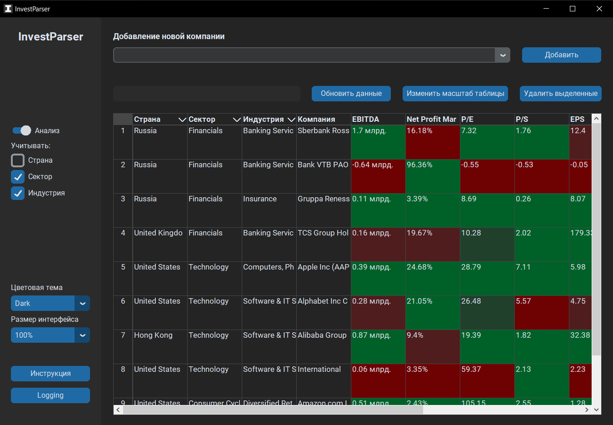
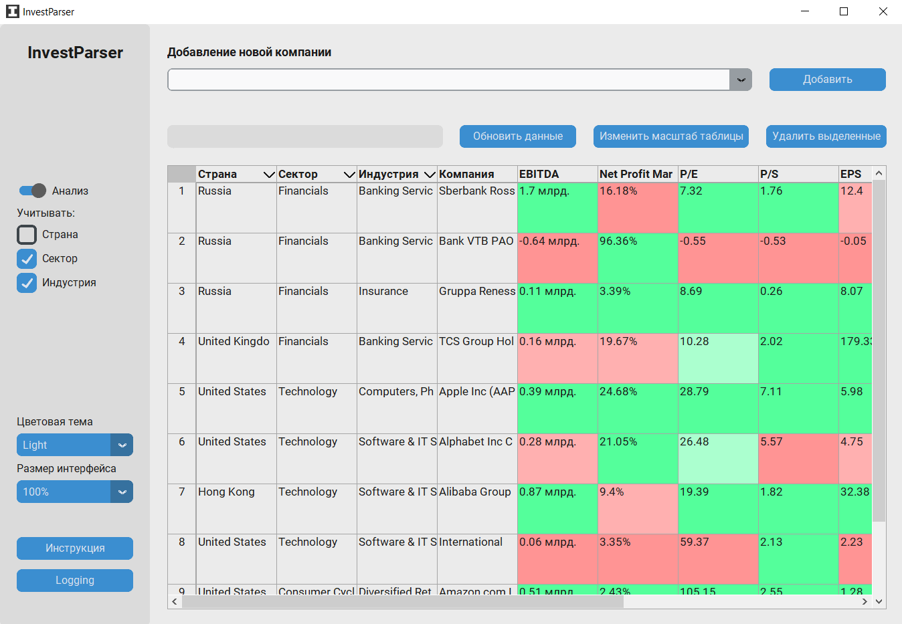
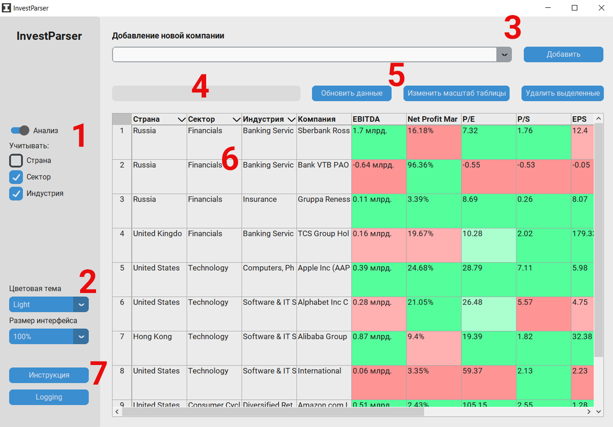

# Проект "InvestParser"
- Desktop приложение для сбора и анализа данных компаний, представленных на биржевом рынке акций.
- Написано на Python 3.11 с использованием библиотеки customtkinter.
- В качестве БД используется SQLite.
- Данные берутся с сайта [Investing.com](https://www.investing.com/)

## Обзор
### Цветовые темы
В приложении можно выбрать подходящую для вас цветовую тему - темную или светлую


### Элементы интерфейса

1. Настройки анализа компаний
 - Вкл/выкл. анализ
 - Настройки группировки:
   - Учитывать страну регистрации
   - Учитывать сектор
   - Учитывать индустрию

2. Настройки внешнего вида приложения
 - Выбор цветовой темы, доступны "Dark" (темная), "Light" (светлая) и "System" (определяется операционной системой)
 - Выбор масштабирования текста и элементов интерфейса

3. Добавление компаний в сравнительную таблицу
 - Поле ввода ключевого слова и поиска полного названия компании, и кнопка для добавления выбранного варианта из списка

4. Окно сообщений
 - При выполнении некоторых операций информирует о статусе выполненных действий. 

5. Панель инструментов таблицы
 - Кнопка "Обновить данные" предназначена для обновления информации о компаниях
 - Кнопка "Изменить размер таблицы" уменьшает или увеличивает масштаб таблицы
 - Кнопка "Удалить выделенные" удаляет выделенные в таблице компании

6. Сравнительная таблица
 - После включения анализа окрашивает данные, которые участвуют в сравнении определенным цветом
 - Отображаемый набор компаний можно фильтровать с помощью выпадающего списка в ячейках-заголовках "Страна", "Сектор" и "Индустрия"

7. Дополнительные данные
 - Инструкция по данному приложению
 - Окно логирования (отображает время и результат выполнения зарегистрированных операций в подробном виде)

## Анализ данных
Для анализа данных используется сравнение следующих индикаторов:

**EBITDA** - выручка компании за последний год. Чем больше, тем лучше.

**Net Margin Profit** - процент от выручки, который составляет прибыль за последний год. Чем больше, тем лучше.

**EPS** - отношение чистой прибыли компании к количеству акций за последний год/квартал. Чем больше, тем лучше.

**P/E** - отношение стоимости акции к чистой прибыли на акцию (EPS) за последний год. Должно быть положительным и как можно ближе к нулю.

**P/S** - отношение стоимости акции к выручке компании. Должно быть положительным и как можно ближе к нулю.

**ROE** - рентабельность собственного капитала (на сколько хорошо капитал оправдывает прибыль) за последний год. Чем больше, тем лучше.

**ROA** - рентабельность активов компании (на сколько хорошо активы генерируют прибыль) за последний год. Чем больше, тем лучше.

**Debt/Equity** - процент заёмных денег от капитала в последнем квартале. Чем меньше, тем лучше.

**Технический анализ** - совокупность прогнозов показателей индикаторов технического анализа за последний месяц.

## Установка и сборка (для разработчиков)
```
// Клонирование репозитория
git clone https://github.com/Scull56/InvestParser.git

// Установка зависимостей
pip install pipenv --user
pipenv install

// Создание нового файла конфигурации для сборки
pyi-makespec src/main.py

// Сборка приложения для Windows
pyinstaller windows.spec
```
